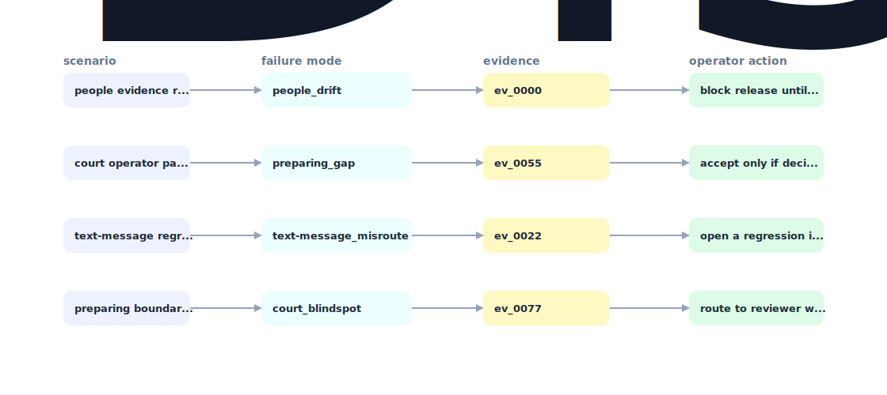

# Court Message Evidence Map

A local evidence map that ingests synthetic SMS/WhatsApp exports, clusters incidents, cites every claim to message IDs, detects coercive-pattern evidence, and emits a lawyer-ready review packet.


## Why it exists

people preparing text-message evidence for court need trauma-aware evidence selection, chain-of-custody clarity, and lawyer-reviewable summaries without hallucinated claims.

Most internal demos stop at a pretty chart. This repository is built around the harder part: a repeatable path from fixture, to failure, to evidence, to the operator action a serious team would actually trust.

## What is inside

- A deterministic replay harness tuned around people, preparing, and text-message.
- Company-specific strategy code in `src/court_message_evidence_map/strategy.py`, not just README-level customization.
- Citation-locked reports where every decision claim has to point back to a generated evidence ID.
- Two visual artifacts generated from the latest run: `outputs/project_working.svg` and `outputs/evidence_map.svg`.
- A portable demo pack with JSON, CSV, Markdown, HTML, SVG, and benchmark artifacts.



## Signals it measures

- `people coverage`
- `preparing risk`
- `text-message precision`
- `court latency`

## Failure modes it plants

- people drift
- preparing gap
- text-message misroute
- court blindspot

## Run it locally

```bash
uv sync
uv run court-message-evidence-map all
uv run pytest -q
uv run ruff check .
```

## Outputs worth opening

- `outputs/dashboard.html`
- `outputs/project_working.svg`
- `outputs/evidence_map.svg`
- `outputs/operator_brief.md`
- `outputs/decision_report.md`
- `outputs/strategy_model.json`
- `outputs/demo_pack.zip`

## Sources

- https://www.disputebuddy.co/
- https://www.disputebuddy.co/our-story
- https://www.trustpilot.com/review/disputebuddy.co

## Boundary

Everything runs locally against synthetic fixtures. There are no credentials, no customer records, no outreach files, and no hosted API dependency.
